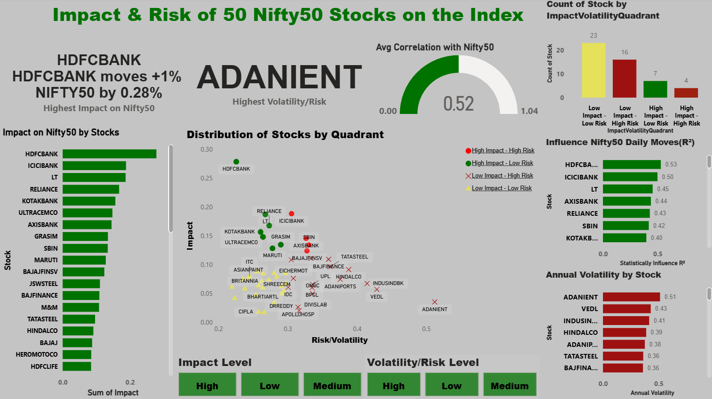

# 🧾 NIFTY50 Stock Influence and Risk-Impact Analysis_Dashboard – Stock Market & Finance

Analyzing 50 stocks of Nifty50 to calculate the influence impact and risk to make a calculated trading decisions with the help of Python and Power Bi.


## 📌 Table of Contents
- <a href="#overview">Overview</a>
- <a href="#business-problem">Business Problem</a>
- <a href="#dataset">Dataset</a>
- <a href="#tools--technologies">Tools & Technologies</a>
- <a href="#project-structure">Project Structure</a>
- <a href="#exploratory-data-analysis-eda">Exploratory Data Analysis (EDA)</a>
- <a href="#data-cleaning--preparation">Data Cleaning & Preparation</a>
- <a href="#feature-engineering-fe">Feature Engineering (FE)</a>
- <a href="#research-questions--key-findings">Key Findings & Analysis</a>
- <a href="#dashboard">Dashboard</a>
- <a href="#how-to-run-this-project">How to Run This Project</a>
- <a href="#final-recommendations">Final Recommendations</a>
- <a href="#author--contact">Author & Contact</a>

---
<h2><a class="anchor" id="overview"></a>Overview</h2>

This project presents a data-driven framework to analyze and categorize NIFTY50 stocks based on their influence on the index and their inherent risk. The goal is to provide traders and investors with a systematic approach for making more informed decisions in options and index strategies, moving away from intuition-based trading.

---
<h2><a class="anchor" id="business-problem"></a>Business Problem & Questions</h2>

The project addresses several key challenges faced by traders:

* A lack of a systematic method to measure the influence of individual stocks on NIFTY50 daily movements.

* The absence of an established framework to categorize stocks by both impact and risk.

* Traders' reliance on intuition rather than data-driven insights.

Business Questions

* Which individual stocks have the largest influence and impact on NIFTY50 daily moves?

* Which stocks create maximum volatility and risk?

* How to categorize stocks by impact & risk for trading strategies?

---
<h2><a class="anchor" id="dataset"></a>Dataset</h2>

* Data fetching through KPI from Yahoo finance.
* Created a excel file to store all raw data from Nifty50 and it's 50 stocks of 10 yaers. 

---

<h2><a class="anchor" id="tools--technologies"></a>Tools & Technologies</h2>

- Python (Pandas, NumPy, Glob & OS)
- Power BI (DAX, Interactive Visualizations)
- GitHub

---
<h2><a class="anchor" id="project-structure"></a>Project Structure</h2>

```
NIFTY50_Influence_Impack_Risk-analysis/
│
├── README.md
├── .gitignore
├── Requirements.txt
├── NIFTY50 Stock Influence and Risk-Impact Analysis_Presentation.pdf
│
├── notebooks/                 # Jupyter notebooks
│   ├── EDA_DataClean_FE.ipynb
│   ├── nifty50_influence_impact_risk_analysis.xlsx
│
├── scripts/                    # Python scripts for ingestion and processing
│   ├── Stock.py
│   
├── dashboard/                  # Power BI dashboard file
│   └── NIFTY50 Stock Influence and Risk-Impact Analysis_Dashboard.pbix
```

---
<h2><a class="anchor" id="exploratory-data-analysis-eda"></a>Exploratory Data Analysis (EDA)</h2>

* SBILIFE and HDFCLIFE have missing values for many dates.
* Reason is that these stocks were listed after mid 2017.
* Different data type and some missing/unique rows.
---
<h2><a class="anchor" id="data-cleaning--preparation"></a>Data Cleaning & Preparation</h2>

* Removed unnecessary column:
  - Open
  - High, low
  - Volume
* Delete misaligned row
* Convert Date column to datetime.
* Convert stock columns to float (numeric).

---
<h2><a class="anchor" id="#feature-engineering-fe"></a>Feature Engineering (FE)</h2>

* **Impact**: A metric combining explanatory power (R²) and the strength of a stock's effect on the NIFTY50 index (β). It measures how much influence a stock has on day-to-day index movements.

* **Annualized Volatility** (Ann_Volatility): This metric measures the historical volatility or risk of a stock's daily moves.

* **Impact-Volatility Quadrant** (IVQ): A final categorization that combines the impact level (High, Medium, Low) and volatility level (High, Medium, Low) to classify stocks (e.g., High Impact - Low Risk).

---
<h2><a class="anchor" id="research-questions--key-findings"></a>Research Questions & Key Findings</h2>

* The analysis revealed significant differences in the influence and risk profiles of NIFTY50 stocks:

* The majority of stocks have a low impact on index movements, while a small handful drive most of the returns and risks.


* High Impact - Low Risk: Stocks like HDFCBANK and LT, which are considered safe for index hedging due to their strong influence and low volatility.

* High Impact - High Risk: Stocks such as RELIANCE and ICICIBANK, which have a strong influence but are volatile, making them suitable for short-term option trading.

* Low Impact - High Risk: Stocks like ADANIENT, which can add noise to a portfolio and should be avoided for hedging strategies.

* The average correlation between NIFTY50 and its individual stocks is moderate (~0.52), indicating that while a basket of high-impact stocks can explain most of the index's moves, the index is not always fully explained by individual stocks.

---
<h2><a class="anchor" id="dashboard"></a>Dashboard</h2>

- Power BI Dashboard shows:
  - Categorizes stocks by impact and risk.
  - KPIs likes highest impact, risk.
  - Provides key calculated metrics like Beta and R².
  - Count of stocks by quadrant.



---
<h2><a class="anchor" id="how-to-run-this-project"></a>How to Run This Project</h2>

1. Clone the repository:
https://github.com/ShinchanSolo/NIFTY50-Influence-and-Risk-Impact-Analysis-Data-Analyst-Project

2. Run Requirement.txt file to install all the required libraries.

3. Run Stock.py to collect all the required data.

4. Open and run notebooks:
   - `EDA_DataClean_FE.ipynb`

5. Open Power BI Dashboard:
   - `dashboard/NIFTY50 Stock Influence and Risk-Impact Analysis.pbix`

---
<h2><a class="anchor" id="final-recommendations"></a>Final Recommendations</h2>

This project provides a valuable framework that empowers traders to:

* Design Smarter Strategies: Categorizing stocks by impact vs. risk helps in choosing between option buying (high impact, low risk) and option selling (high volatility, high premium) strategies.

* Improve Risk Management: Traders can better manage their risk exposure by avoiding hedging with low-impact, high-risk stocks that add noise to their portfolio.

* Enhance Decision-Making: The integrated dashboard allows traders to monitor and act on high-impact stocks in real-time, improving the consistency of their trading decisions.

---
<h2><a class="anchor" id="author--contact"></a>Author & Contact</h2>

**Soloman Londhe**  
Aspiring Data Analyst  
📧 Email: solomanlondhe0123@gmail.com  
🔗 [LinkedIn](https://www.linkedin.com/in/saloman-londhe-ba9183344/)